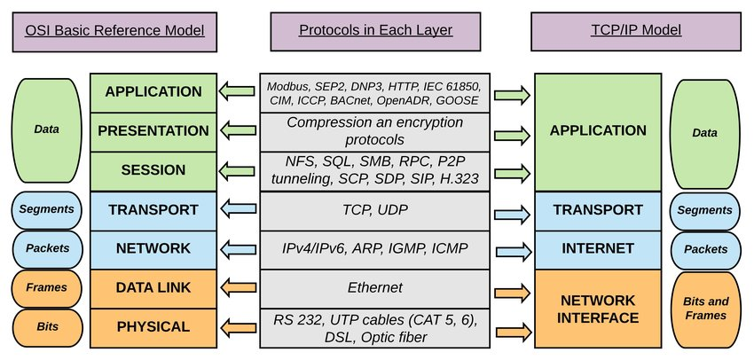

# MY Notes For Pentesting

### IP Addresses

| IP V4                                       | IP V6                                 |
| ------------------------------------------- | ------------------------------------- |
| Inet = ipv4 = (decimal notation)            | inet6 = ipv6 = (hexadecimal notation) |
| Communication with layer 3 of OSI           |                                       |
| Example: 192.168.57.139 = 32 bits = 4 bytes |                                       |
| Ipv4 = 2^32 = 4.294,967,296                 | ipv6 = 2^128 = 3.40283e+38            |

### IP Meaning

#### 17.172.22.44

| 17              | 172             | 22              | 44              |                           |
| --------------- | --------------- | --------------- | --------------- | ------------------------- |
| 8 bits (1 byte) | 8 bits (1 byte) | 8 bits (1 byte) | 8 bits (1 byte) | total = 32 bits (4 bytes) |
| Country         | State           | ISP             | Device          |                           |

### Types of IPs

| Private                  | Public                  | Static | Dynamic                 |
| ------------------------ | ----------------------- | ------ | ----------------------- |
| Local Area Network (LAN) | Wide Area Network (WAN) | Fixed  | Changed after some time |

### Roles of Networking Ports

* Total ports: 65535
* States: open, closed, filtered
* Well-known ports: 0-1023
* Registered ports: 1024-49151
* Dynamic ports: 49152-65535

### IP Rules

| Public = Public | Private = Private | Public ≠ Private | Private ≠ Public |
| --------------- | ----------------- | ---------------- | ---------------- |
|                 |                   |                  |                  |

### Port Rules

### What is Network Protocols?

* Set of rules
* How data is transmitted
* Device communication

### Common Protocols

| TCP                           | UDP                    |
| ----------------------------- | ---------------------- |
| Transmission Control Protocol | User Datagram Protocol |
|                               |                        |

### How TCP Works?

#### Flags and Usage

| URG (Urgent)                                                 | FIN (Finish)                          | RST (Reset)         | PSH (Push)                          | SYN (Synchronize)                    | ACK (Acknowledgement)                |
| ------------------------------------------------------------ | ------------------------------------- | ------------------- | ----------------------------------- | ------------------------------------ | ------------------------------------ |
| Data contained in the packet should be processed immediately | There will be no further transmission | Resets a connection | Sends all buffered data immediately | Initiates a connection between hosts | Acknowledges the receipt of a packet |
|                                                              |                                       |                     |                                     |                                      |                                      |

### TCP Three-way Handshake

| Person 1 (SYN) -> Person 2 | Person 2 <- (SYN + ACK) | Person 1 -> (ACK) |
| -------------------------- | ----------------------- | ----------------- |
|                            |                         |                   |

### TCP Session Termination

| Person 1 (FIN) -> Person 2 | Person 2 <- ACK Person 1 | Person 2 <- FIN Person 1 | Person 1 ACK -> Person 2 |
| -------------------------- | ------------------------ | ------------------------ | ------------------------ |
|                            |                          |                          |                          |

### UDP

| Request > | < Response | > Response |
| --------- | ---------- | ---------- |
|           |            |            |

## Network Layers


<figure><figcaption></figcaption></figure>

### In depth

<figure><figcaption></figcaption></figure>


<figure><figcaption></figcaption></figure>

## Wire shark

*   Wire shark commands

    ```bash
    # To view the tcp syn flags with out ack flags

    tcp.flags.syn==1 and tcp.flags.ack==0

    # To VIew only TCP port 25 
    tcp.port==25

    # To VIew only TCP port 23 
    tcp.port==23

    ```

## How to Scan a Host, Subnet, or IP Range**Course content**

***

*   Scan a host

    ```bash
    nmap scanme.namp.org
    ```

    ```
    scan an IP
    ```

    ```bash
    namp 192.168.4.1
    ```
*   Subnet scan

    ```bash
    nmap 10.211.55.0/24

    nmap 10.211.55.0/24 10.211.55.0/24
    ```

## **The Top Five Nmap Commands**

<figure><figcaption></figcaption></figure>





